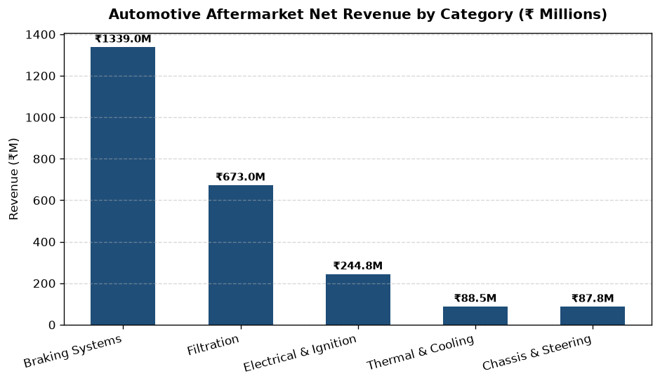
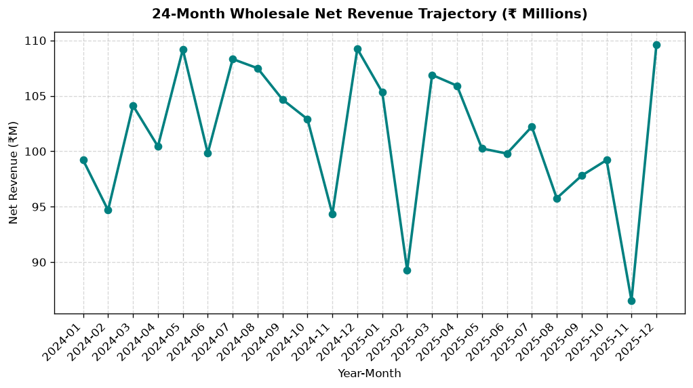
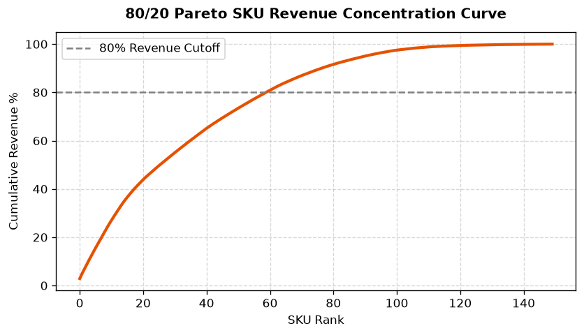
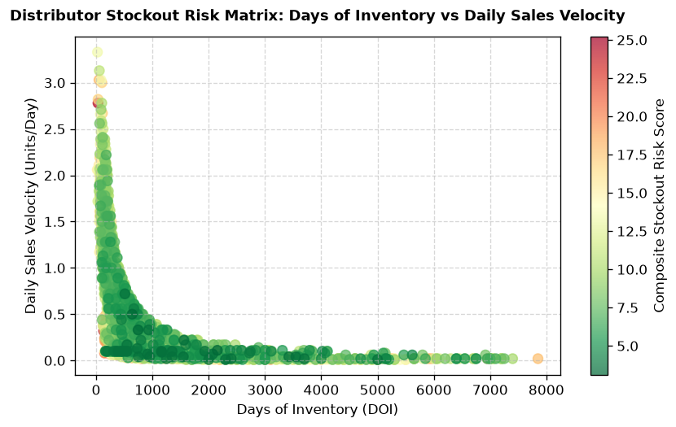
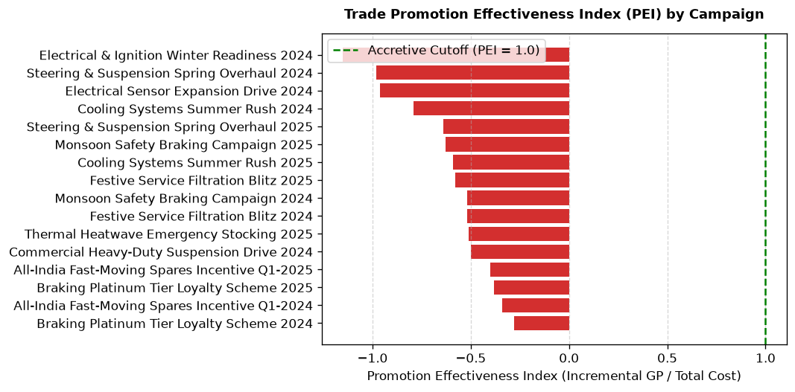
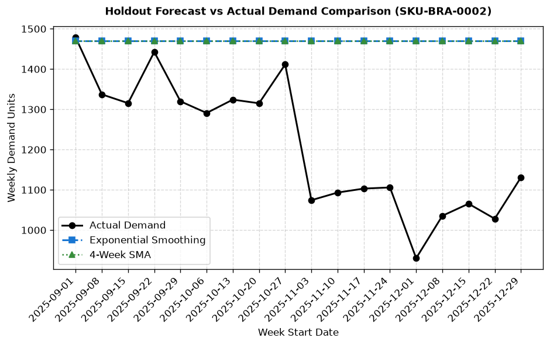

# Power BI Visual Intelligence & Reporting Suite

This folder contains the complete Power BI dimensional semantic model, DAX measure formulations, and exported visual artifacts.

## Dashboard Visual Artifacts & Previews

The platform includes 4 dedicated executive dashboard reporting pages:

### 1. Executive Sales Overview & Category Trajectory

*Figure 1: Net Revenue Contribution & Margin Health across the 5 Core Automotive Categories.*

*Figure 2: 24-Month Continuous Wholesale Revenue Run-Rate (FY 2024 - 2025).*

*Figure 3: 80/20 Cumulative Pareto Concentration Curve (Top 29.3% SKUs drive 80% Revenue).*

---

### 2. Inventory Health & Stockout Exposure

*Figure 4: Distributor Stockout Risk Matrix — Days of Inventory (DOI) vs. Daily Sales Velocity.*

---

### 3. Trade Marketing & Promotion Effectiveness

*Figure 5: B2B Trade Campaign Viability & Net Incremental Profit Return (PEI Benchmark).*

---

### 4. Demand Forecasting & Operational Replenishment

*Figure 6: 17-Week Out-of-Sample Holdout Demand Forecast Benchmark (Naive vs SMA vs Exponential Smoothing).*

---

## Loading Data into Power BI Desktop
1. Open **Power BI Desktop**.
2. Navigate to **Get Data** -> **Text/CSV** (or connect directly to `data/processed/aftermarket.db` via ODBC/SQLite driver).
3. Import the dimensional tables and fact datasets from `data/processed/`:
   - `dim_date.csv`
   - `dim_product.csv`
   - `dim_distributor.csv`
   - `dim_region.csv`
   - `dim_promotion.csv`
   - `dim_sku_pareto.csv`
   - `fact_sales.csv`
   - `fact_inventory.csv`
   - `fact_demand.csv`
   - `analytical_inventory_risk_scores.csv`
   - `analytical_reorder_parameters.csv`
   - `analytical_promotion_effectiveness.csv`
   - `analytical_sku_opportunity_matrix.csv`
4. Set up 1-to-many single-directional relationships in the **Model View** as specified in `data-model.md`.
5. Copy the DAX measures detailed in `data-model.md`.
